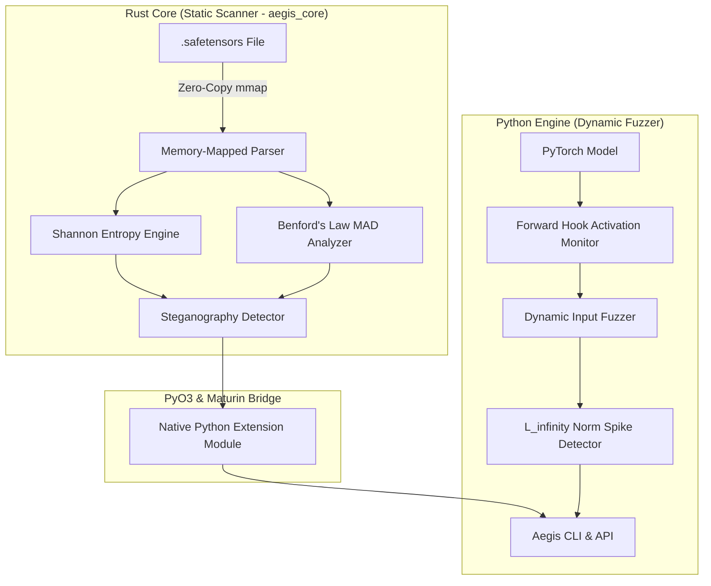

# 🛡️ Aegis-Tensor

**Aegis-Tensor** is a high-performance, open-source security scanner designed to detect advanced adversarial threats—specifically **Steganography (hidden malware)** and **Sleeper Agent Trojans (backdoors)**—inside AI models formatted as `.safetensors`.

---

## ⚡ The Threat Model

1. **Model Steganography:**
   Adversaries embed malicious executables, C2 configurations, or exfiltrated private data within the float32 weight tensors of neural networks (e.g. by modifying mantissa bits or substituting whole weight slices with high-entropy encrypted blobs). Standard antivirus tools cannot parse deep learning weight containers, and traditional `.safetensors` validation only inspects the JSON header, leaving the raw tensor data unverified.
2. **Sleeper Agent Trojans & Backdoors:**
   Adversarial actors train neural networks with dormant backdoors that behave normally on regular evaluation sets, but trigger catastrophic or malicious behaviors upon encountering specific covert trigger inputs. These triggers often induce massive, anomalous spikes in internal layer activations ($L_\infty$ norm anomalies).

---

## 🏛️ Architecture



### 1. Rust Core (`aegis_core`) — Static Scanner
- **Zero-Copy Memory Mapping (`memmap2`):** Reads multi-gigabyte `.safetensors` files without loading them into memory, minimizing RAM usage.
- **Shannon Entropy Analysis:** Computes byte-level information entropy ($H(X) = -\sum P(x)\log_2 P(x)$). Clean neural network weights have distinct non-uniform entropy profiles; encrypted or compressed binary payloads approach maximal entropy ($8.0$ bits/byte).
- **Benford's Law Conformance:** Evaluates the distribution of first significant digits against Benford's Law ($P(d) = \log_{10}(1 + 1/d)$). Deviations (MAD) expose synthetic, non-natural float values injected into weights.
- **Rayon Parallelism:** Tensors across large models are analyzed concurrently across all CPU cores.

### 2. Python Engine — Dynamic Fuzzer
- **Activation Hooking:** Hooks into model layers via PyTorch `register_forward_hook`.
- **$L_\infty$ Norm Monitoring:** Tracks the maximum absolute activation values ($\|x\|_\infty = \max |x_i|$) across all intermediate representations under fuzzed inputs.
- **Spike Detection:** Flags dormant Sleeper Agent triggers when activations exhibit non-linear explosive spikes relative to baseline distributions.

### 3. The Bridge (`PyO3` + `maturin`)
- Bridges the low-level, high-throughput Rust static analysis core directly into Python, enabling seamless CLI usage and programmatic integration into MLOps pipelines.

---

## 🚀 Quick Start

### Prerequisites
- Python 3.9+
- [Rust & Cargo](https://rustup.rs/)
- [Maturin](https://github.com/PyO3/maturin)

### 1. Build the Rust Extension & Install Package
```bash
# Clone the repository
git clone https://github.com/your-org/Aegis_Tensor.git
cd Aegis_Tensor

# Create and activate a virtual environment
python3 -m venv .venv
source .venv/bin/activate

# Install maturin and dependencies
pip install --upgrade pip maturin

# Build and install the Rust core extension in development mode
maturin develop
```

### 2. Verify Installation
```bash
aegis doctor
```

---

## 🔍 CLI Usage

### Static Scan of a `.safetensors` Model
Scan any `.safetensors` weights file for embedded malware payloads and statistical weight anomalies:
```bash
aegis scan /path/to/model.safetensors
```

Customize sensitivity thresholds:
```bash
aegis scan /path/to/model.safetensors \
  --entropy-threshold 7.90 \
  --benford-threshold 0.035 \
  --output-json report.json
```

### Dynamic Trojan Fuzzing (Python API)
```python
import torch
from aegis.fuzzer import DynamicTrojanFuzzer

# Load your PyTorch model
model = load_my_model()

# Initialize dynamic fuzzer
fuzzer = DynamicTrojanFuzzer(model, spike_threshold=4.0)

# Run fuzzing with input generator and baseline input
report = fuzzer.run_fuzzing(
    sample_inputs_generator=lambda i: torch.randn(1, 3, 224, 224),
    baseline_input=torch.zeros(1, 3, 224, 224),
    num_iterations=100,
)

print(f"Suspected Trojan: {report.suspected_trojan}")
print(f"Max activation spike ratio: {report.spike_ratio:.2f}x")
print(f"Suspicious layers: {report.suspicious_layers}")
```

---

## 📚 Project Documentation
- [Academic Research Compendium & Literature Review](docs/RESEARCH_COMPENDIUM.md) *(Deep-dive survey, IEEE/ACM citations, mathematical models)*
- [System Requirements & Threat Model](docs/REQUIREMENTS.md)
- [Technology Stack Specification](docs/TECH_STACK.md)
- [Deep Architectural & Mathematical Specification](docs/ARCHITECTURE.md)
- [Development Roadmap & Milestones](docs/PHASES.md)
- [Team Roles & Task Allocation](docs/TEAM_ALLOCATION.md)

---

## 👥 Engineering Team

| Contributor | Focus Area | GitHub |
| :--- | :--- | :--- |
| **Krish Gupta** | Lead Architect, Rust Core & FFI Bridge | [@KrishG7](https://github.com/KrishG7) |
| **Himanshu Chhillar** | Cryptanalysis, Shannon Entropy & Benford's Law | [@HimanshuChhillar](https://github.com/HimanshuChhillar) |
| **Daksh Dahiya** | Dynamic Activation Fuzzing & Hook Instrumentation | [@7dxksh7](https://github.com/7dxksh7) |
| **Amandeep Singh** | CLI UX, Reporting, Benchmarking & CI/CD | [@Amandeep-bajwa](https://github.com/Amandeep-bajwa) |
| **Mukul Chauhan** | Project Presentation & Documentation Support | [@Mukul09800](https://github.com/Mukul09800) |

---

## 📁 Project Structure

```
Aegis_Tensor/
├── Cargo.toml          # Rust package configuration for aegis_core
├── pyproject.toml      # Python packaging configured with Maturin backend
├── .gitignore          # Git ignore rules for Rust, Python, and model weights
├── README.md           # Documentation and architecture guide
├── docs/               # Detailed project specifications
│   ├── REQUIREMENTS.md # Functional & non-functional requirements
│   ├── TECH_STACK.md   # Tech stack, libraries, and hardware profiles
│   ├── ARCHITECTURE.md # Mathematical foundations and pipeline flows
│   ├── PHASES.md       # Development phases and milestones
│   └── TEAM_ALLOCATION.md # Work breakdown and RACI matrix
├── src/
│   └── lib.rs          # Rust Core: mmap, Shannon entropy, Benford's Law, PyO3 bindings
└── aegis/
    ├── __init__.py      # Package initialization & exports
    ├── cli.py          # Rich & Typer-based command line interface
    └── fuzzer.py       # Dynamic PyTorch forward_hook fuzzer ($L_\infty$ monitoring)
```

---

## 🛡️ Security & Research Roadmap
- [x] Zero-copy memory-mapped parsing of `.safetensors`
- [x] Shannon entropy calculation on raw tensor byte streams
- [x] Benford's Law MAD deviation testing on float32 weights
- [x] PyTorch forward-hook dynamic activation monitor with $L_\infty$ norm
- [ ] Automated trigger perturbation generator (genetic / gradient-guided input fuzzing)
- [ ] Safe sandbox quarantine for suspicious models
- [ ] HuggingFace Hub integration for pre-download vetting

---

## 📄 License
Licensed under the [Apache License, Version 2.0](LICENSE).

